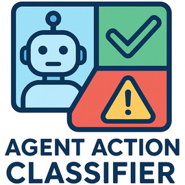
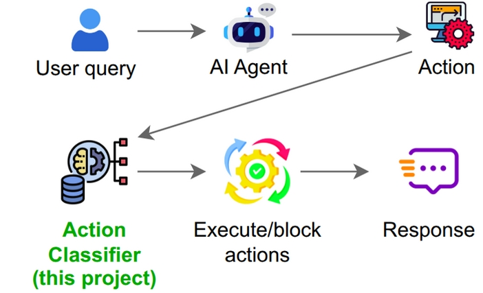
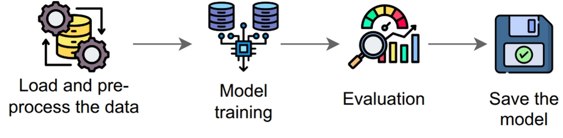

<!-- $ convert logo_large.png -resize 270x270 project_logo.jpg -->

# Agent Action Classifier: Classifying AI agent actions to ensure safety and reliability

A neural network model to classify actions proposed by autonomous AI agents as harmful or safe. The model has been based on a small dataset of labeled examples.

[](./assets/paper-ActionClassifier.pdf)
[]()
[]()
[]()
[](./LICENSE.md)
[](https://medium.com/@praneeth.v/the-agent-action-classifier-a-step-toward-safer-autonomous-ai-agents-1ec57a601449)
<!-- [](https://doi.org/10.XXXXX/XXXXX) -->

### Implementation


#### Training



### Usage:
1. Create a virtual environment and install dependencies:

```bash
python3 -m venv .venv
source .venv/bin/activate
pip install -r requirements.txt
```

For development (optional, includes linting, formatting, and testing tools):

```bash
pip install -r requirements-dev.txt
```

2. Train the model (Optional):

```bash
python3 train_nn.py
```

3. Implement the trained model in LLM calls - run the example:

```bash
python3 run_sample_query.py
```

### Files:
- `sample_actions.json` — dataset of action prompts and labels/resources in MCP-like format.
- `train_nn.py` — small script that trains a neural network model and saves the trained model.
- `action_classifier.py` — module that loads the trained model and provides a function to classify actions.
- `run_sample_query.py` — script to classify new actions using the trained model (example wrapper).
- `requirements.txt` — minimal dependencies.
- `requirements-dev.txt` — development dependencies (linting, formatting, testing tools).

### Citation
If you find this repository useful in your research, please consider citing:
```bibtex
@misc{vadlapati2025agentactionclassifier,
  author       = {Vadlapati, Praneeth},
  title        = {Agent Action Classifier: Classifying AI agent actions to ensure safety and reliability},
  year         = {2025},
  howpublished = {\url{https://github.com/Pro-GenAI/Agent-Action-Classifier}},
  note         = {GitHub repository},
}
```

### Created based on my past work

Agent-Supervisor: Supervising Actions of Autonomous AI Agents for Ethical Compliance: [GitHub](https://github.com/Pro-GenAI/Agent-Supervisor)


**Image credits**:
- User icon: https://www.flaticon.com/free-icon/user_9131478
- Robot icon: https://www.flaticon.com/free-icon/robot_18355220
- Action: https://www.flaticon.com/free-icon/automation_2103800
- Action classifier: https://www.flaticon.com/free-icon/data-processing_7017511
- Executing/blocking actions: https://www.flaticon.com/free-icon/control-system_12539814
- Response: https://www.flaticon.com/free-icon/fast-response_10748876

- Data Processing: https://www.flaticon.com/free-icon/data-processing_8438966
- AI training: https://www.flaticon.com/free-icon/data-ai_18263195
- Evaluation: https://www.flaticon.com/free-icon/benchmarking_10789334
- Saving the model: https://www.flaticon.com/free-icon/save_4371273
